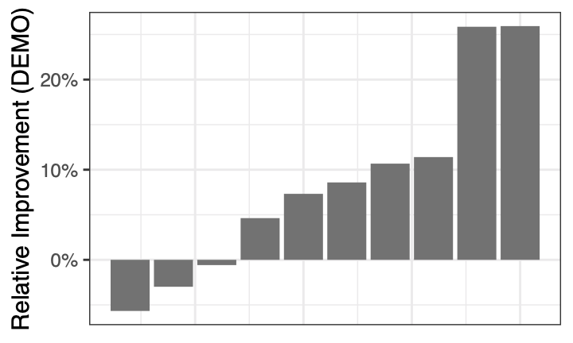

# Osimertinib and Dacomitinib Combination Schedule Optimization in EGFR-m NSCLC
## First Author: Kamrine Poels
## Corresponding Author: Franziska Michor
## Institution: Dana Farber Cancer Institute

README last updated: 01/11/21

## System Requirements

The collection of scripts in this repository were composed and tested using R version 3.5.0 or newer. R package dependencies are: `tidyverse`, `pracma`, `xtable`, `reshape`, `nlme`, `reshape2`, `ggpubr`, `scatterplot3d`, `randomForest`.

[Ubiquity](https://link.springer.com/article/10.1007/s10928-014-9352-6) (Harrold J.M. and Abraham A.K *J Pharmacokinet Pharmacodyn* 2014) dependencies include: `deSolve`, `foreach`, `doParallel`, `doRNG`. Supplementary data includes download instructions and demos. 

## Demo

The dosing schedules explored in the manuscript yield large files. To simplicy the reproducibility of our model, we simulated two demo files with the following characteristics:

- 10 patients with same clinical characteristics
- 1 week of treatment
- Schedule 1: 80 mg Osimertinib QD; schedule 2: 80 mg Osimertinib QD + 40 mg Dacomitinib QD

These files are found in `Demo/Concentrations_demo/exampleConcentrations.RData`. When loading into R, two objects in a list format should appear in the work environmnet. Each object is a simulation of drug concentrations in plasma and PK parameters of two drugs in 10 patients and consists of 5 elements. The drug-concentration values used in the *in silico* trial is under the element "Outputs" with vectors named "C_osi" and "C_daco_c".

We can obtain expected cell counts for these 10 subjects under each schedule by running `Demo/Code_demo/run_demo.R`. Output should be a 2 data frames, each with 10 observations an 4 variables. Rows are the expected cell counts of each individual at the end of one-week treatment and each column is a cell type. The output is saved in the `Results_Demo` folder. The script should take 5 to 10 seconds to run on a typical computer.

In order to compare the performance of these two schedules, one can run the script `estimateRelativeImprovement.R`. The script will take the expected cell counts from the output that was saved in the `Results_Demo`. If run with default settings, it saves a waterfall plot titled `demoWaterplot.pdf`, showing the distribution of the relative improvement of demo schedule 2 over demo schedule 1 by patient. If there is one more comparison of interest or user would like to use different input, the script must be edited (locations are pointed out in the script's comments).

## Description of repository

### Code
All essential code for manuscript can be found in this directory. `Cannon/` has the scripts that were sent to the cluster Odyssey (now called Cannon) to run the *in silico* clinical trials. Each R script contains a description of its function at the top.

#### Estimation of growth rates
Data from cell growth assays (drug combo of osimertinib + dacomitinib) used to populate tumor growth/evolution model can be found in the folders:

- "Data from Aaron": (from Hata lab): 3-day assays for PC9 parental/derivative cell lines, including C797S which is not available in Pfizer. 
- "Data from Scott": Pfizer; 3-day assays for PC9 parental/derivative cell lines and HCC827 parental and MET-amp cell lines. The popPK model of dacomitinib can be found in this folder under `Dacomitinib`.

The scripts `Code/predictGrowthRates_*.R` estimate the growth rates for each cell type using the data listed above. Scripts with the subscript `*_AH.R` use Aaron Hata's cell lines. The file `Code/saveAllFitsAndRates.R` runs all `predictGrowthRates_*.R` scripts and saves estimated parameters and fitted models in an RData format. The output is in `newFitsAndRates200229.RData`.

##### HCC827 cell line
The analysis from the HCC827 cell lines (parental and MET-amp) was not included in the main manuscript. However, the code used to estimate growth parameters at different drug concentrations can be found in `Code/HCC827growths/`. Cell line labeled HCC827R corresponds to the METamp cell line. `Code/convertHCC2PC9_met.R` "converts" HCC227 growth rates to a comparative value to that of PC9 cell lines by standardizing estimated rates. 

#### Drug concentration simulations
The drug concentrations were simulated using [Ubiquity](https://link.springer.com/article/10.1007/s10928-014-9352-6). In `Code/osimertinib_dacomitinib/`, I simulated drug concentrations (using a two compartment model for each drug) from published popPK models. 

Instructions to obtain drug concentrations over time:
1. Plug-in parameters in system.txt
2. Open analysis_multiple.r to set doses, frequency of doses, sample size, (in lines 37-60) and execute.
3. Save drug concentrations of two compartments and individual PK parameters.

Speed of simulations depends on sample size and frequency of observations per simulated patient. I simulated 1000 patients up to 8 weeks or 1 year under many different drug-combo schedules. The output files exceed 100 Mb and are not compatible with GitHub. I can share these via another method. 

#### *In silico* clinical trials

I uploaded `Code/Cannon/Code` to Cannon (at the time called Odyssey) along with the simulated drug concentrations. For each population of patients, we simulated a total of 7 dosing regimens (we actually simulated many other schedules but these 7 are presented in the manuscrip). The traditional regimens are titled `run_group1.*.R`, and the proposed are `run_group2.*.R`. The script `predictCount_ubiquity.R` is called in the other scripts to estimate the expected number of tumors cells at the end of treatment; code is written to read Ubiquity output. Shell script `batchArray.sh` runs all scripts in Odyssey using an [array mode](https://docs.rc.fas.harvard.edu/kb/running-jobs/#Job_arrays). [Results](#results) presented in manuscript are in repository.

In `estimateRelativeImprovement.R`, we estimate the relative improvement of proposed schedule over traditional schedule using the same metric as in Chakrabarti and Michor, *Cancer Research* 2017. We use a random forest to estimate importance of PK profiles and pre-existence of resistant clones in respect to improvement, `improvement_randomForest.R`. 

#### Validation experiments

`Code/calculateSteadyState.R` estimates an average concentration of drugs at steady state for  simulated patients. The input is an RData file containing 3-4 outputs from Ubiquity, which I can share upon request. This was done to identify drug concentrations that would be used in the *in vitro* validation experiments. 

All data from validation experiments can be found in `Validation data/`. Experiments finished on different dates, which is reflected in the dating of the folders and files. All scripts in `Code/ValidationExperiments_200827/` simulate cell counts under various combinations of drug concentrations (using [ESTIpop](https://github.com/Michorlab/estipop)) and results are ploted in `plotValidationExperiments.R`. 

### Results
Results of *in silico* trials can be found in directories named `Results_*`. The folder `Results_102719` is a 2 cycle treatment trial (with different drug correlation PK parameters). The folder `Results_200520` corresponds to the same trial but for substantially heavier patients. Lastly, the folder `Results_121119` contains *in silico* one-year trials (with no treatment breaks).
